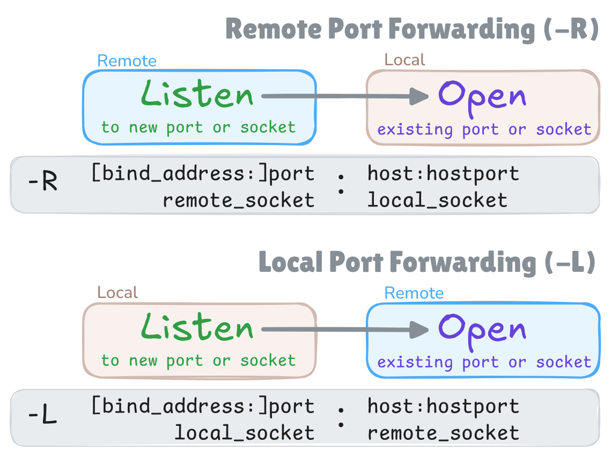

# Docker SSH Tunnel

This project provides Alpine-based Docker images
for setting up a persistent SSH tunnel
between two containers on different servers.

## Server image

```shell
docker pull ghcr.io/querateam/docker-ssh-tunnel/server
```

The server image supports the following environment variables:

#### SSH keys

| Environment Variable                                | Description                                                                                                      |
| --------------------------------------------------- | ---------------------------------------------------------------------------------------------------------------- |
| `SERVER_ED25519_PRIVATE_KEY_BASE64` <br> _required_ | The server's host private key (ed25519). The client needs to have the corresponding public key in `known_hosts`. |
| `SERVER_ED25519_PUBLIC_KEY`                         | The server's host public key (ed25519).                                                                          |
| `CLIENT_AUTHORIZED_KEYS` <br> _required_            | The client public keys authorized to connect as `tunnel` user. The keys should be separated by semicolons (`;`). |

#### SSHD options

For more information, see the [`sshd_config(5)`](https://linux.die.net/man/5/sshd_config) manual.

| Environment Variable                 | Equivalent sshd Argument   | Default Value     |
| ------------------------------------ | -------------------------- | ----------------- |
| `SSHD_PORT`                          | Port                       | `22`              |
| `SSHD_PERMIT_ROOT_LOGIN`             | PermitRootLogin            | `no`              |
| `SSHD_PERMIT_EMPTY_PASSWORDS`        | PermitEmptyPasswords       | `no`              |
| `SSHD_PASSWORD_AUTHENTICATION`       | PasswordAuthentication     | `no`              |
| `SSHD_AUTHENTICATION_METHODS`        | AuthenticationMethods      | `publickey`       |
| `SSHD_CLIENT_ALIVE_INTERVAL`         | ClientAliveInterval        | `10`              |
| `SSHD_CLIENT_ALIVE_COUNT_MAX`        | ClientAliveCountMax        | `30`              |
| `SSHD_LOGIN_GRACE_TIME`              | LoginGraceTime             | `30`              |
| `SSHD_GATEWAY_PORTS`                 | GatewayPorts               | `clientspecified` |
| `SSHD_PERMIT_TUNNEL`                 | PermitTunnel               | `no`              |
| `SSHD_PERMIT_TTY`                    | PermitTTY                  | `no`              |
| `SSHD_PERMIT_USER_RC`                | PermitUserRC               | `no`              |
| `SSHD_PERMIT_OPEN`                   | PermitOpen                 | -                 |
| `SSHD_PERMIT_LISTEN`                 | PermitListen               | -                 |
| `SSHD_ALLOW_TCP_FORWARDING`          | AllowTcpForwarding         | `remote`          |
| `SSHD_ALLOW_STREAM_LOCAL_FORWARDING` | AllowStreamLocalForwarding | `no`              |
| `SSHD_X11_FORWARDING`                | X11Forwarding              | `no`              |
| `SSHD_ALLOW_AGENT_FORWARDING`        | AllowAgentForwarding       | `no`              |
| `SSHD_FORCE_COMMAND`                 | ForceCommand               | `/sbin/nologin`   |
| `SSHD_ALLOW_USERS`                   | AllowUsers                 | `tunnel`          |

## Client image

```shell
docker pull ghcr.io/querateam/docker-ssh-tunnel/client
```

The client image uses `autossh` to establish a persistent SSH tunnel.
The client image supports the following environment variables:

#### SSH keys

| Environment Variable                                | Equivalent ssh_config Argument                                                   |
| --------------------------------------------------- | -------------------------------------------------------------------------------- |
| `SERVER_ED25519_PUBLIC_KEY` <br> _required_         | The server's host public key (ed25519). This key will be added to `known_hosts`. |
| `CLIENT_ED25519_PRIVATE_KEY_BASE64` <br> _required_ | The client's SSH private key.                                                    |

#### SSH options

For more information, see the [`ssh_config(5)`](https://linux.die.net/man/5/ssh_config) manual.

| Environment Variable          | Equivalent ssh_config Argument | Default Value |
| ----------------------------- | ------------------------------ | ------------- |
| `SSH_HOSTNAME` _required_     | Hostname                       | -             |
| `SSH_PORT`                    | Port                           | `22`          |
| `SSH_SERVER_ALIVE_INTERVAL`   | ServerAliveInterval            | `10`          |
| `SSH_SERVER_ALIVE_COUNT_MAX`  | ServerAliveCountMax            | `3`           |
| `SSH_EXIT_ON_FORWARD_FAILURE` | ExitOnForwardFailure           | `yes`         |
| `SSH_SESSION_TYPE`            | SessionType                    | `none`        |

You can pass arguments to `ssh` command using the `SSH_CLI_OPTIONS` environment variable.
You can define the SSH port forwarding using this variable (`-R` and `-L` options).
Please note that the server image only supports
remote port forwarding by default for security reasons.
If you want to use local port forwarding,
you need to enable it in the server image
by setting the `SSHD_ALLOW_TCP_FORWARDING` environment variable to `local` or `all`.
In this case, consider `SSHD_PERMIT_OPEN` option to restrict the port forwarding.



#### Autossh options

All [autossh environment variables](https://github.com/Autossh/autossh)
are supported, but the following variables have a default set in this image:

| Environment Variable | Default Value |
| -------------------- | ------------- |
| `AUTOSSH_PORT`       | `0`           |
| `AUTOSSH_GATETIME`   | `0`           |
| `AUTOSSH_POLL`       | `30`          |

In this image, the autossh monitoring function is turned off by default (`AUTOSSH_PORT=0`).
Instead of the monitoring function,
this image uses `ServerAliveInterval`, `ServerAliveCountMax`, and `ExitOnForwardFailure` SSH options
to have the SSH client exit if it finds itself no longer connected to the server.
As a result, autossh detects the connection problem and restarts SSH.

## Key generation

You need two SSH key pairs to establish a secure SSH connection
without the risk of MITM (Man-In-The-Middle) attacks.
We encode the private keys in base64 format to pass them as environment variables.

```shell
ssh-keygen -t ed25519 -N '' -C key1-$(date -I) -f key1
cat key1 | base64 -w 0 > key1.base64

ssh-keygen -t ed25519 -N '' -C key2-$(date -I) -f key2
cat key2 | base64 -w 0 > key2.base64
```

> [!WARNING]  
> Make sure both private keys are kept secret.
> Any file containing a private key should be protected with proper file permissions.

## Example usage

In this example, both client and server containers are run on the same host.
But in a real-world scenario,
the client and server containers should be run on different hosts.

Start server and client services:

```shell
KEY1_BASE64=$(cat key1.base64)
KEY2_PUB=$(cat key2.pub)
docker run --name tunnel-server --rm -it --init \
  --user 12345:12345 \
  -e SERVER_ED25519_PRIVATE_KEY_BASE64="$KEY1_BASE64" \
  -e CLIENT_AUTHORIZED_KEYS="$KEY2_PUB" \
  -e SSHD_PERMIT_LISTEN="0.0.0.0:4444" \
  -p 2222:22 \
  -p 127.0.0.1:4444:4444 \
  ghcr.io/querateam/docker-ssh-tunnel/server
```

```shell
KEY2_BASE64=$(cat key2.base64)
KEY1_PUB=$(cat key1.pub)
docker run --name tunnel-client --rm -it --init --add-host=host.docker.internal:host-gateway \
  --user 12345:12345 \
  -e SERVER_ED25519_PUBLIC_KEY="$KEY1_PUB" \
  -e CLIENT_ED25519_PRIVATE_KEY_BASE64="$KEY2_BASE64" \
  -e SSH_HOSTNAME="host.docker.internal" \
  -e SSH_PORT="2222" \
  -e SSH_CLI_OPTIONS="-R 0.0.0.0:4444:127.0.0.1:6666" \
  ghcr.io/querateam/docker-ssh-tunnel/client
```

To test the tunnel connection,
run the following commands in separate terminals:

```shell
docker exec -it tunnel-client /usr/bin/nc -l -s 127.0.0.1 -p 6666
```

```shell
nc 127.0.0.1 4444
```

Type some text and press `Enter` in one terminal.
You should see the text in the other terminal.

## Docker compose example

```yaml
services:
  tunnel-server:
    image: ghcr.io/querateam/docker-ssh-tunnel/server
    restart: always
    user: 12345:12345
    environment:
      SERVER_ED25519_PRIVATE_KEY_BASE64: ... value of key1.base64 ...
      CLIENT_AUTHORIZED_KEYS: ... value of key2.pub ...
      SSHD_PERMIT_LISTEN: 0.0.0.0:4444
    ports:
      - 2222:22
      - 127.0.0.1:4444:4444

  tunnel-client:
    image: ghcr.io/querateam/docker-ssh-tunnel/client
    restart: always
    user: 12345:12345
    environment:
      SERVER_ED25519_PUBLIC_KEY: ... value of key1.pub ...
      CLIENT_ED25519_PRIVATE_KEY_BASE64: ... value of key2.base64 ...
      SSH_HOSTNAME: host.docker.internal
      SSH_PORT: 2222
      SSH_CLI_OPTIONS: -R 0.0.0.0:4444:127.0.0.1:6666
    extra_hosts:
      - host.docker.internal:host-gateway
```

To test the tunnel connection,
run the following commands in separate terminals:

```shell
docker compose exec -it tunnel-client /usr/bin/nc -l -s 127.0.0.1 -p 6666
```

```shell
nc 127.0.0.1 4444
```

Type some text and press `Enter` in one terminal.
You should see the text in the other terminal.
