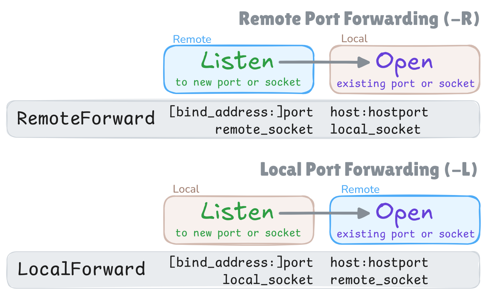

# Docker SSH

This project provides Alpine-based OpenSSH Docker images (server and client)
specially useful for creating secure SSH tunnels between containers,
or for securely syncing files between containers using rsync.

Both images support running as an arbitrary user via `--user` on `docker run`.

## Server image

```shell
docker pull ghcr.io/querateam/docker-ssh/server
```

The server image supports the following environment variables:

#### SSH keys

| Environment Variable                              | Description                                                                                                              |
| ------------------------------------------------- | ------------------------------------------------------------------------------------------------------------------------ |
| `SERVER_ED25519_PRIVATE_KEY_FILE` <br> _required_ | Path to the server's host private key (ed25519). The client needs to have the corresponding public key in `known_hosts`. |
| `SERVER_ED25519_PRIVATE_KEY_BASE64`               | Alternative to `SERVER_ED25519_PRIVATE_KEY_FILE` (base64-encoded value).                                                 |
| `SERVER_ED25519_PUBLIC_KEY`                       | The server's host public key (ed25519).                                                                                  |
| `CLIENT_AUTHORIZED_KEYS` <br> _required_          | The client public keys authorized to connect. The keys should be separated by semicolons (`;`).                          |

#### SSHD options

For more information, see the [`sshd_config(5)`](https://linux.die.net/man/5/sshd_config) manual.

| Environment Variable                 | sshd_config Option         | Default           |
| ------------------------------------ | -------------------------- | ----------------- |
| `SSHD_PORT`                          | Port                       | `22`              |
| `SSHD_PERMIT_ROOT_LOGIN`             | PermitRootLogin            | `no`              |
| `SSHD_PERMIT_EMPTY_PASSWORDS`        | PermitEmptyPasswords       | `no`              |
| `SSHD_PASSWORD_AUTHENTICATION`       | PasswordAuthentication     | `no`              |
| `SSHD_AUTHENTICATION_METHODS`        | AuthenticationMethods      | `publickey`       |
| `SSHD_CLIENT_ALIVE_INTERVAL`         | ClientAliveInterval        | `10`              |
| `SSHD_CLIENT_ALIVE_COUNT_MAX`        | ClientAliveCountMax        | `30`              |
| `SSHD_LOGIN_GRACE_TIME`              | LoginGraceTime             | `30`              |
| `SSHD_GATEWAY_PORTS`                 | GatewayPorts               | `clientspecified` |
| `SSHD_PERMIT_TUNNEL`                 | PermitTunnel               | `no`              |
| `SSHD_PERMIT_TTY`                    | PermitTTY                  | `no`              |
| `SSHD_PERMIT_USER_RC`                | PermitUserRC               | `no`              |
| `SSHD_PERMIT_OPEN`                   | PermitOpen                 | -                 |
| `SSHD_PERMIT_LISTEN`                 | PermitListen               | -                 |
| `SSHD_ALLOW_TCP_FORWARDING`          | AllowTcpForwarding         | `no`              |
| `SSHD_ALLOW_STREAM_LOCAL_FORWARDING` | AllowStreamLocalForwarding | `no`              |
| `SSHD_X11_FORWARDING`                | X11Forwarding              | `no`              |
| `SSHD_ALLOW_AGENT_FORWARDING`        | AllowAgentForwarding       | `no`              |
| `SSHD_FORCE_COMMAND`                 | ForceCommand               | `/sbin/nologin`   |

## Client image

```shell
docker pull ghcr.io/querateam/docker-ssh/client
```

By default, the client image uses `autossh` to establish a persistent SSH connection.
The client image supports the following environment variables:

#### SSH keys

| Environment Variable                              | Description                                                                      |
| ------------------------------------------------- | -------------------------------------------------------------------------------- |
| `SERVER_ED25519_PUBLIC_KEY` <br> _required_       | The server's host public key (ed25519). This key will be added to `known_hosts`. |
| `CLIENT_ED25519_PRIVATE_KEY_FILE` <br> _required_ | Path to the client's SSH private key.                                            |
| `CLIENT_ED25519_PRIVATE_KEY_BASE64`               | Alternative to `CLIENT_ED25519_PRIVATE_KEY_FILE` (base64-encoded value)          |

#### SSH options

For more information, see the [`ssh_config(5)`](https://linux.die.net/man/5/ssh_config) manual.

| Environment Variable          | ssh_config Option    | Default |
| ----------------------------- | -------------------- | ------- |
| `SSH_HOSTNAME` _required_     | Hostname             | -       |
| `SSH_PORT`                    | Port                 | `22`    |
| `SSH_REMOTE_FORWARD`          | RemoteForward        | -       |
| `SSH_LOCAL_FORWARD`           | LocalForward         | -       |
| `SSH_SERVER_ALIVE_INTERVAL`   | ServerAliveInterval  | `10`    |
| `SSH_SERVER_ALIVE_COUNT_MAX`  | ServerAliveCountMax  | `3`     |
| `SSH_EXIT_ON_FORWARD_FAILURE` | ExitOnForwardFailure | `yes`   |
| `SSH_SESSION_TYPE`            | SessionType          | `none`  |

#### Autossh options

All [autossh environment variables](https://github.com/Autossh/autossh)
are supported, but the following variables have a default set in this image:

| Environment Variable | Default |
| -------------------- | ------- |
| `AUTOSSH_PORT`       | `0`     |
| `AUTOSSH_GATETIME`   | `0`     |
| `AUTOSSH_POLL`       | `30`    |

In this image, the autossh monitoring function is turned off by default (`AUTOSSH_PORT=0`).
Instead of the monitoring function,
this image uses `ServerAliveInterval`, `ServerAliveCountMax`, and `ExitOnForwardFailure` SSH options
to have the SSH client exit if it finds itself no longer connected to the server.
As a result, autossh detects the connection problem and restarts SSH.

#### Scheduling options

Instead of running `autossh`, you can use the following variables
to periodically run a command.

| Environment Variable | Description                                                    |
| -------------------- | -------------------------------------------------------------- |
| `SCHEDULE`           | A cron expression. Refer to the [cronexpr] doc for the syntax. |
| `SCHEDULE_CMD`       | A command to run periodically.                                 |

## Key generation

You need two SSH key pairs to establish a secure SSH connection
without the risk of MITM (Man-In-The-Middle) attacks.

```shell
ssh-keygen -t ed25519 -N '' -C key1-$(date -I) -f key1
ssh-keygen -t ed25519 -N '' -C key2-$(date -I) -f key2
```

> [!WARNING]  
> Make sure both private keys are kept secret.
> Any file containing a private key should be protected with proper file permissions.

## Usage: SSH Tunnel

You can define the SSH tunnel using `SSH_REMOTE_FORWARD` and `SSH_LOCAL_FORWARD`
variables of the client image. They map to `RemoteForward` and `LocalForward` options in `ssh_config`.

Each of these variables can have multiple port forwarding rules separated by semicolons (`;`).

By default, TCP forwarding is disabled in the server image.
To enable port forwarding,
you need to set the `SSHD_ALLOW_TCP_FORWARDING` environment variable
to `remote`, `local` or `all`, depending on the type(s) of port forwarding you want to allow.
When enabling TCP forwarding,
also set `SSHD_PERMIT_LISTEN` or `SSHD_PERMIT_OPEN` option (or both) to restrict the port forwarding.

You can learn more about remote and local forwarding by reading `RemoteForward` and `LocalForward`
sections in [ssh_config(5)](https://linux.die.net/man/5/ssh_config).
I have made a simple cheatsheet:



In the following example, both client and server containers are run on the same host.
But in a real-world scenario,
the client and server containers should be run on different hosts
and you need to expose port `22` of the server container to the public network.

```yaml
# docker-compose.yml

services:
  tunnel-server:
    image: ghcr.io/querateam/docker-ssh/server
    restart: always
    user: 12345:12345 # must have read access to key1
    secrets:
      - key1
    environment:
      SERVER_ED25519_PRIVATE_KEY_FILE: /run/secrets/key1
      CLIENT_AUTHORIZED_KEYS: ... value of key2.pub ...
      SSHD_ALLOW_TCP_FORWARDING: remote
      SSHD_PERMIT_LISTEN: 127.0.0.1:4444

  tunnel-client:
    image: ghcr.io/querateam/docker-ssh/client
    restart: always
    user: 12345:12345 # must have read access to key2
    secrets:
      - key2
    environment:
      CLIENT_ED25519_PRIVATE_KEY_FILE: /run/secrets/key2
      SERVER_ED25519_PUBLIC_KEY: ... value of key1.pub ...
      SSH_HOSTNAME: tunnel-server
      SSH_REMOTE_FORWARD: 127.0.0.1:4444 127.0.0.1:6666

secrets:
  key1:
    file: ./key1
  key2:
    file: ./key2
```

Run `docker compose up` to start the services and establish the tunnel.
To test the tunnel,
run the following commands in separate terminals:

```shell
docker compose exec -it tunnel-client /usr/bin/nc -l -s 127.0.0.1 -p 6666
```

```shell
docker compose exec -it tunnel-server /usr/bin/nc 127.0.0.1 4444
```

Type some text and press `Enter` in one terminal.
You should see the text in the other terminal.

## Usage: rsync

Both server and client images have `rsync` installed.
You can override the `command` of the client image
to your custom script which uses `rsync` to sync files
between the client and server containers.

You can also use the scheduling options of the client image
to run an rsync command periodically.

To use rsync securely, you need to restrict the user's ssh login
to only allow the running of an rsync transfer.
A simple solution is to force the running of an rsync daemon-over-ssh command
and define restrictions
in [`rsyncd.conf`](https://download.samba.org/pub/rsync/rsyncd.conf.5)
in the server container.

In the following example, a file is synced to the server every midnight.

```ini
# rsyncd.conf
# https://download.samba.org/pub/rsync/rsyncd.conf.5

# Define "/data/" path as "mydata" module.
# The client can only write to this path, and can't read or delete anything.
[mydata]
path = /data/
read only = false
write only = true
refuse options = delete
```

```yaml
# docker-compose.yml

services:
  rsync-server:
    image: ghcr.io/querateam/docker-ssh/server
    restart: always
    user: 12345:12345 # must have read access to key1
    secrets:
      - key1
    environment:
      SERVER_ED25519_PRIVATE_KEY_FILE: /run/secrets/key1
      CLIENT_AUTHORIZED_KEYS: ... value of key2.pub ...
      SSHD_FORCE_COMMAND: rsync --server --daemon --config=/etc/rsyncd.conf .
    volumes:
      - ./rsyncd.conf:/etc/rsyncd.conf:ro
      - ./server-data:/data

  rsync-client:
    image: ghcr.io/querateam/docker-ssh/client
    restart: always
    user: 12345:12345 # must have read access to key2
    secrets:
      - key2
    environment:
      CLIENT_ED25519_PRIVATE_KEY_FILE: /run/secrets/key2
      SERVER_ED25519_PUBLIC_KEY: ... value of key1.pub ...
      SSH_SESSION_TYPE: default
      SSH_HOSTNAME: rsync-server
      # Run once a day at midnight.
      SCHEDULE: "@daily"
      # Instead of "/data" path, use the module name "mydata".
      SCHEDULE_CMD: /usr/bin/rsync -z -e ssh /somefile rsync-server::mydata
    volumes:
      - ./somefile:/somefile:ro

secrets:
  key1:
    file: ./key1
  key2:
    file: ./key2
```

[cronexpr]: (https://github.com/aptible/supercronic/tree/master/cronexpr)
